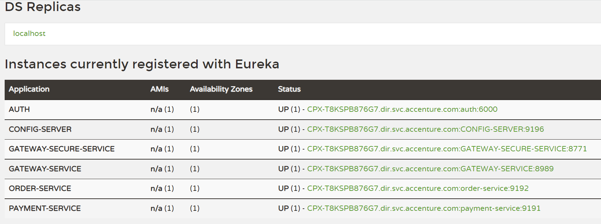
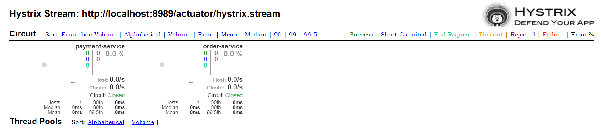
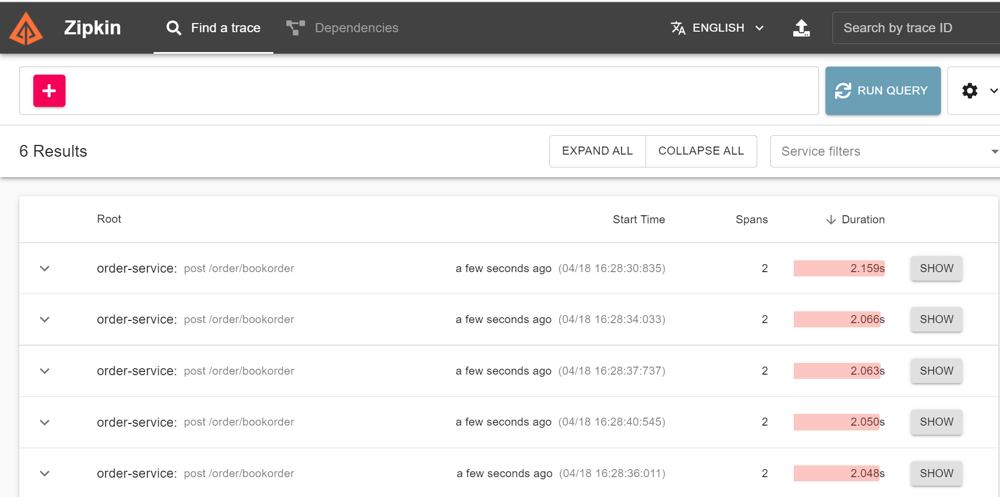

#  Important Url 

| SERVICE                           | 	URL's                                        |
|-----------------------------------|-----------------------------------------------|
| EurekaRegistry	                   | http://localhost:8761	                        |
| CONFIG-SERVER	                    | http://localhost:9196	                        |
| GATEWAY-SERVICE	                  | http://localhost:8989                         |
| GATEWAY-SERVICE	[Test Env]        | http://localhost:9196/order-service/dev       |
| ORDER-SERVICE	                    | http://localhost:9192                         |
| PAYMENT-SERVICE	                  | http://localhost:9191                         |
| Hystrix-DashBoard	                | http://localhost:9195/hystrix                 |
| Stream-URL	                       | http://localhost:8989/actuator/hystrix.stream |
 | Zipkin URL [run zipkin jar first] | http://localhost:9411/zipkin                  |
| Swagger URl [Order Service]       | http://localhost:9192/swagger-ui.html         |
| Order H2                          | http://localhost:9191/h2-console              |
| PAYMENT-H2	                       | http://localhost:9192/h2-console              |
| GATEWAY-Secure SERVICE	           | http://localhost:9191/8771                    |
| Auth Service	                     | http://localhost:6000/auth/login              |

			
**Non Secure Gateway**
-----------------------------------------------------

Request Body  
    Method : Post  
    URL : http://localhost:8989/order/bookOrder 

	"order":{
		"id":12345,
		"name":"Mobile",
		"qty":1,
		"price":8000
		
	},
	"payment":{}

Response  
Method :GET 
URL : http://localhost:8989/payment/12345

	{
    "paymentId": 6,
    "paymentStatus": "false",
    "transactionId": "9a6dd588-9220-4b06-a943-61ef97e69e16",
    "orderId": 12345,
    "amount": 8000.0
    }
}

**Secure Gateway**
-----------------------------------------------------

1. generate access token  
   1.Request Body  
   2.Method :Post   
   3 URL : http://localhost:6000/auth/login

                   {
                       "id": "test"	
                   }
2. Response 
   1. will get access token

Request Body  
Method :Post  
URL : http://localhost:8771/order/bookOrder
Header :

| Key           | 	Value                             |
|---------------|------------------------------------|
| Authorization	 | Token which is genreated in step 1 |

	"order":{
		"id":12345,
		"name":"Mobile",
		"qty":1,
		"price":8000
		
	},
	"payment":{}

Response  
Method :GET  
URL : http://localhost:8771/payment/12345  
Header :

| Key           | 	Value                             |
|---------------|------------------------------------|
| Authorization	 | Token which is genreated in step 1 |

	{
    "paymentId": 6,
    "paymentStatus": "false",
    "transactionId": "9a6dd588-9220-4b06-a943-61ef97e69e16",
    "orderId": 12345,
    "amount": 8000.0
    }
}

Note :

| ErrorCode         | 	Value                                  |
|-------------------|-----------------------------------------|
| 401 Unauthorized	 | accessing url without Token             |
| 400 Bad Request   | Token is expire [token valid for 3 min] |

**Eureka Server**
-----------------------------------------------------

**Hystrix Dashboard**
-----------------------------------------------------

**Access Token**
-----------------------------------------------------

**Zipkin Server**
-----------------------------------------------------

